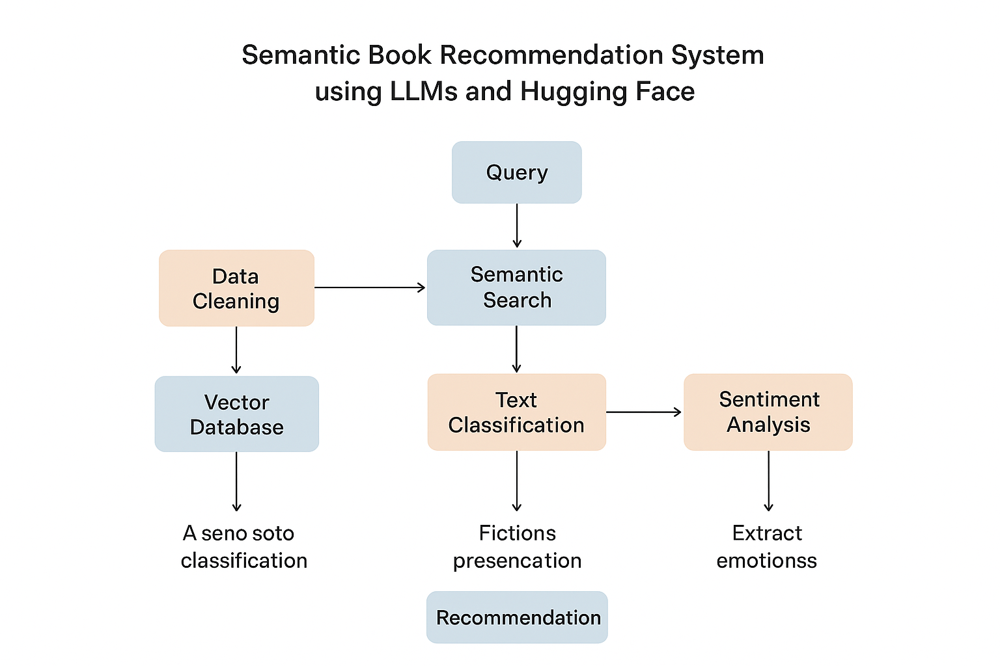

# 📚 Semantic Book Recommendation System using LLMs   

> A next-generation **semantic recommendation engine** that understands stories, themes, and emotions — powered by **Large Language Models (LLMs)**, **Hugging Face embeddings**, and **LangChain**.  

---

## 🧠 Project Overview  

This project implements a **semantic book recommendation system** that allows users to query in **natural language** (e.g., *"a story about revenge and redemption"*) and get **intelligent, emotion-aware book suggestions**.  

It integrates **semantic search**, **zero-shot classification**, and **sentiment analysis**, presented through **Gradio** and **Streamlit** web applications.  

---

## 🏗️ Project Components  

### 🔍 1. Data Exploration & Cleaning (`data-exploration.ipynb`)
- Explore the **7k books dataset**.  
- Handle missing values and clean descriptions for better semantic embeddings.

### 🧭 2. Semantic Vector Search (`vector-search.ipynb`)
- Convert book descriptions into embeddings using  
  `sentence-transformers/all-mpnet-base-v2`.  
- Store and query embeddings via a **Chroma vector database**.  
- Supports semantic queries like *"books about overcoming loss"*.

### 🏷️ 3. Text Classification (`text-classification.ipynb`)
- Perform **zero-shot classification** to label books as *fiction* or *non-fiction*.  
- Add filters for refined recommendations.

### 💬 4. Sentiment & Emotion Analysis (`sentiment-analysis.ipynb`)
- Extract emotional tones (joy, sadness, suspense, etc.) from book descriptions.  
- Enable ranking of recommendations by emotional relevance.

### 🌐 5. Web Applications
- **Gradio App** (`gradio-dashboard.py`) → simple, interactive prototype.  
- **Streamlit App** (`app.py`) → polished, wide-layout dashboard for exploration.

---

## 🧾 Dataset  

- **Name:** 7k Books Dataset (CSV format)  
- **Usage:** Local data for embedding generation, classification, and sentiment extraction  

---

## 🔑 Environment Variables  

Create a `.env` file in the root directory containing your Hugging Face API token:
```bash
HUGGINGFACEHUB_API_TOKEN="your_token_here"
 ```
⚙️ Dependencies

Built with Python 3.11 and the following major libraries:

```bash
kagglehub
pandas
matplotlib
seaborn
python-dotenv
langchain-community
langchain-opencv
langchain-chroma
transformers
gradio
streamlit
notebook
ipywidgets
kagglehub  
pandas  
matplotlib  
seaborn  
python-dotenv  
langchain-community  
langchain-opencv  
langchain-chroma  
transformers  
gradio  
streamlit  
notebook  
ipywidgets

Install all dependencies using:

pip install -r requirements.txt
 ```
### 🔄 Project Workflow
```bash
flowchart TD
A[Data Cleaning] --> B[Vector Database Creation]
B --> C[Text Classification]
C --> D[Emotion Extraction]
D --> E[Recommendation Engine]
E --> F[Deployment: Gradio / Streamlit]
 ```
### **Workflow Steps:**

1)Data Cleaning: Preprocess and sanitize book data.

2)Vector Database: Convert descriptions to embeddings with ChromaDB.

3)Text Classification: Label using zero-shot LLM classification.

4)Emotion Extraction: Derive emotional sentiment per description.

5)Recommendation Engine: Rank and return top book matches.

6)Deployment: Serve through Gradio or Streamlit apps.

### **▶️ How to Run**
#### **Streamlit App**
```bash
streamlit run app.py
 ```
Gradio App
```bash
python gradio-dashboard.py
```
⚠️ Ensure that .env and the dataset CSV are available in the project root before running.


### 📂 Folder Structure
 ```bash
.
├── app.py                    # Streamlit application
├── gradio-dashboard.py       # Gradio interface
├── data-exploration.ipynb    # Data cleaning and EDA
├── vector-search.ipynb       # Semantic search with embeddings
├── text-classification.ipynb # Zero-shot classification
├── sentiment-analysis.ipynb  # Emotion extraction
├── books_with_emotions.csv   # Processed dataset
├── tagged_descriptions.txt   # Text data for embeddings
├── requirements.txt          # Dependencies
└── .env                      # API keys
```
### **☁️ Deployment**
🧩 Render.com
Use a start.sh like:
```bash
streamlit run app.py --server.port $PORT --server.address 0.0.0.0
```
**`_### ##WORKFLOW DIAGRAM_`**
<p align="center">  </p>

🏆 Credits

Inspired by the freeCodeCamp Tutorial – Build a Semantic Book Recommender with LLMs
Uses Hugging Face embeddings and LangChain for semantic search and text analytics.

👤 Author

Deepak Kumar
📧 [[deepakk.ug23.ec@nitp.ac.in]()
]
   
🌐 [GitHub](https://github.com/Deep07954)
 • [LinkedIn](https://www.linkedin.com/in/deepak-kumar-4529bb28a)


